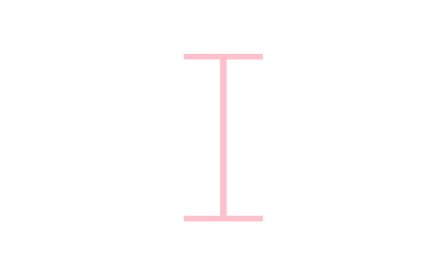
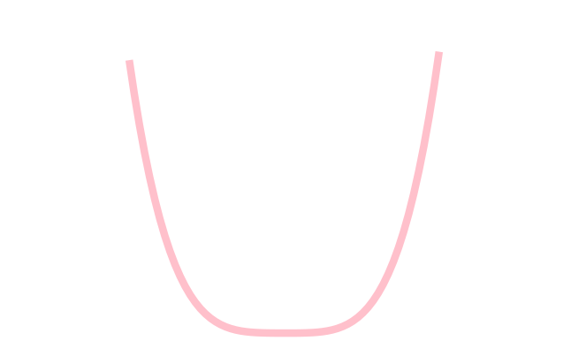
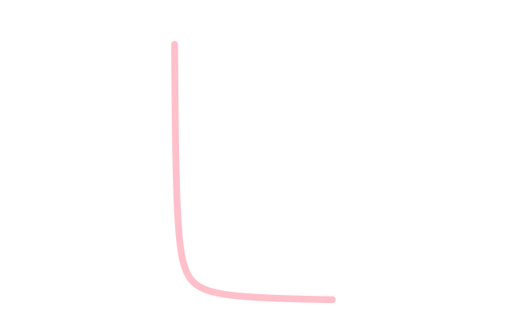
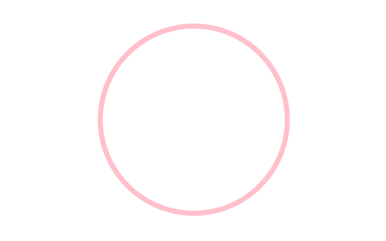

```{r setup, include=FALSE}
knitr::opts_chunk$set(echo = FALSE)
```

## Background

Happy Valentines Day my beloved Shayla!

As you know, I enjoy dabbling in all things visualization and math. I figured a delightful gift for you would be to create a little card telling how much I love you, utilizing some mathiness. I used one of my graphing programs (ggplot2) to generate the message shown below in two ways.


```{r image_grobs, fig.show = "hold", out.width = "30%", fig.align = "default"}







```


________________________________________________________________________________


```{r fig.show = "hold", out.width = "50%", fig.align = "center"}


```

```{r fig.show = "hold", out.width = "25%", fig.align = "default"}






knitr::include_graphics("E.svg")

```

```{r fig.show = "hold", out.width = "50%", fig.align = "center"}


```

I also wanted to show you a few hearts I created to expressed my love.


With love from your amazed husband,

David


# Code

These are the equations I used to make the letters and the hearts, with the exception of the I and O, which I created using graph code.

### L
$y = \frac{1}{x}$

### V
$y=\lvert x\rvert$

### E
$x=-3\lvert sin(y)\rvert$


### First Heart
$x=4(3sin(\theta) - sin(3\theta))$
$y=13cos(\theta) - 5cos(2\theta) - cos(4\theta)$

### Second Heart
$r(\theta) = 2-2sin\theta+sin\theta \frac{\sqrt{\lvert cos\theta \rvert}}{sin\theta + 1.4}$
