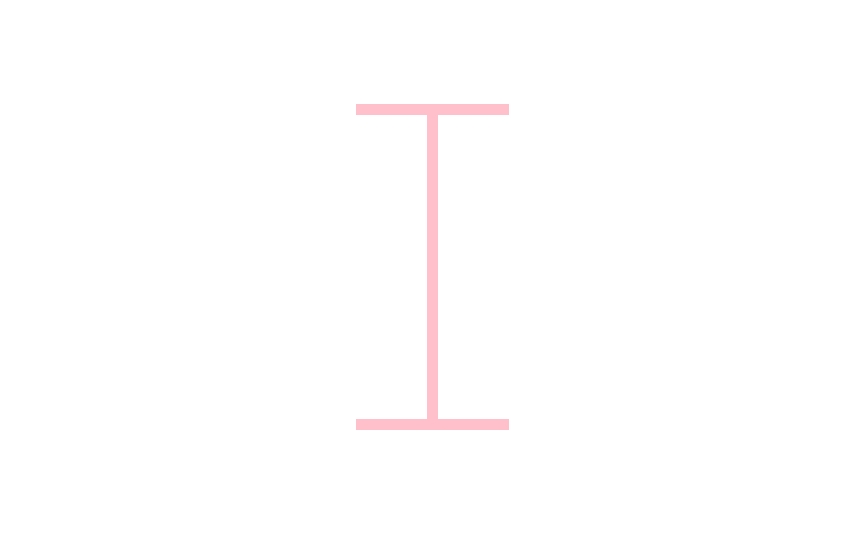
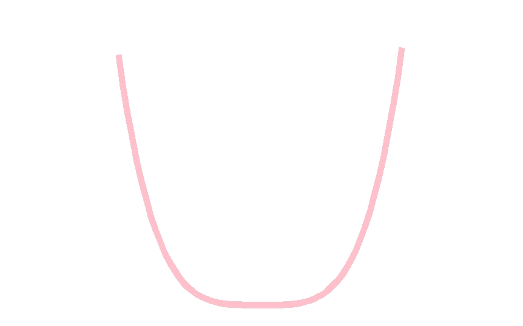
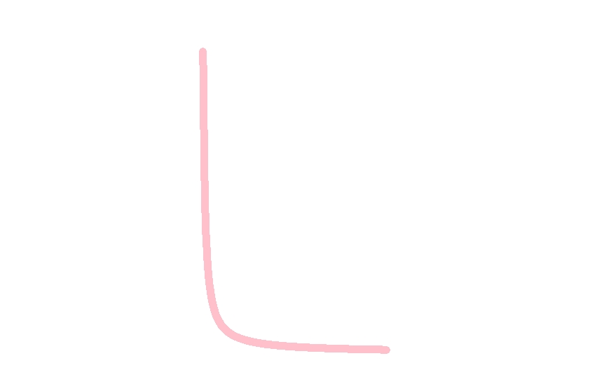
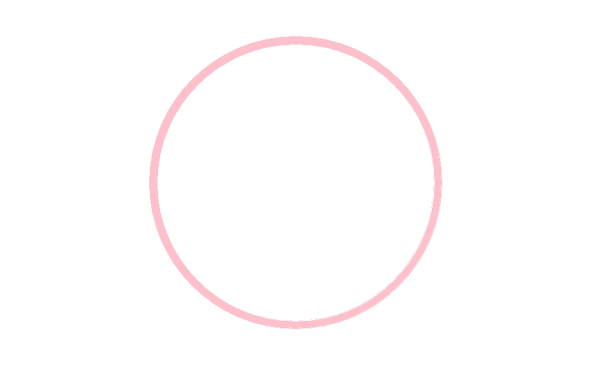
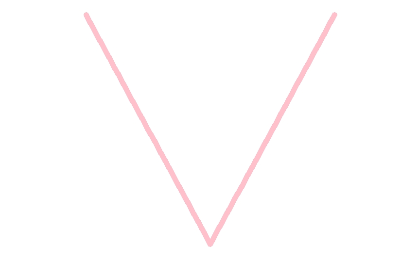
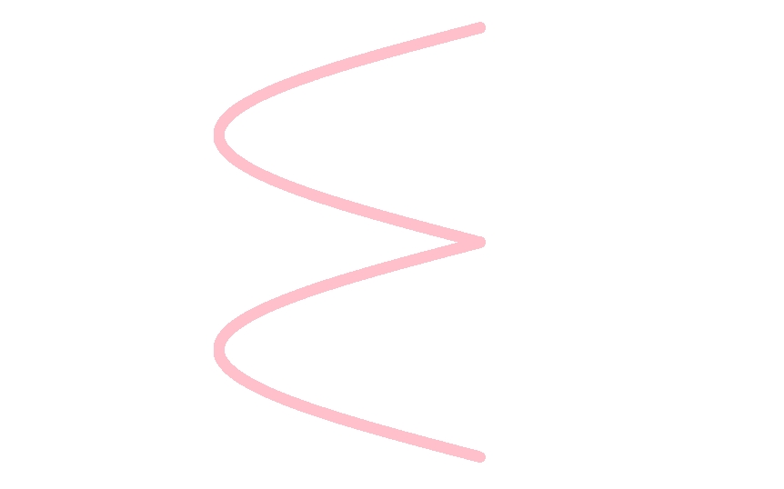

```{r setup, include=FALSE}
knitr::opts_chunk$set(echo = FALSE)
```


### Happy Valentines Day my beloved Shayla!

### As you know, I enjoy dabbling in all things visualization and math. I figured a delightful gift for you would be to create a little card telling how much I love you, utilizing some mathiness. I used one of my graphing programs (ggplot2) to generate the message shown below in two ways.


```{r image_grobs, fig.show = "hold", out.width = "30%", fig.align = "default"}







```


________________________________________________________________________________


```{r fig.show = "hold", out.width = "50%", fig.align = "center"}


```

```{r fig.show = "hold", out.width = "25%", fig.align = "default"}









```

```{r fig.show = "hold", out.width = "50%", fig.align = "center"}


```

### I also wanted to show you another heart I created to express my love.

```{r fig.show = "hold", out.width = "50%", fig.align = "center"}

knitr::include_graphics("Heart1.jpeg")

```

### These are the equations I used to make the letters and the hearts, with the exception of the I and O, which I created using graph code.

$\LARGE y = \frac{1}{x} \hspace{8cm}$
```{r fig.show = "hold", out.width = "50%", fig.align = "default"}


```


$\LARGE y=\lvert x\rvert \hspace{8cm}$
```{r fig.show = "hold", out.width = "50%", fig.align = "default"}


```


$\LARGE x=-3\lvert sin(y)\rvert \hspace{6cm}$
```{r fig.show = "hold", out.width = "50%", fig.align = "default"}


```


$\LARGE x=4(3sin(\theta) - sin(3\theta))\\
\LARGE y=13cos(\theta) - 5cos(2\theta) - cos(4\theta)$
```{r fig.show = "hold", out.width = "50%", fig.align = "default"}

knitr::include_graphics("Heart1.jpeg")

```


$\LARGE r(\theta) = 2-2sin\theta+sin\theta \frac{\sqrt{\lvert cos\theta \rvert}}{sin\theta + 1.4} \hspace{1.2cm}$
```{r fig.show = "hold", out.width = "50%", fig.align = "default"}


```

# With love from your adoring husband,

# David